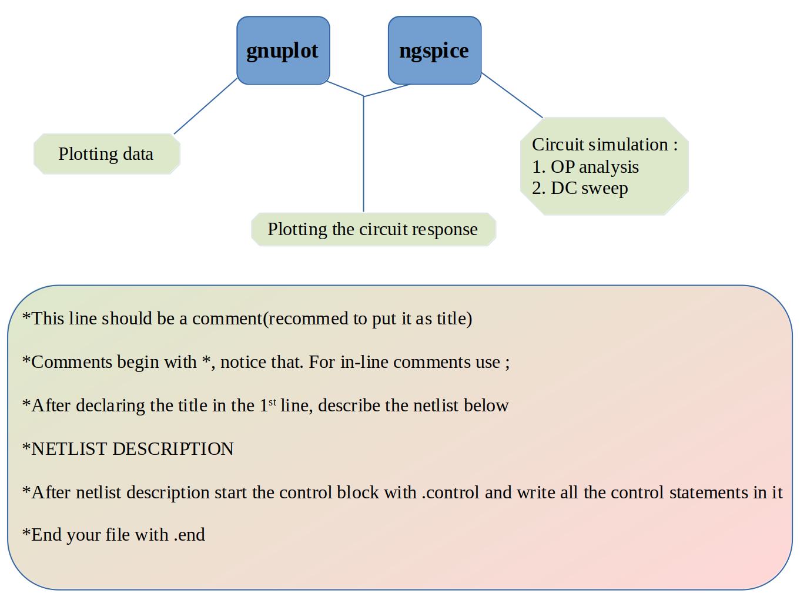

# TUTORIAL 2

**What we’ll cover today ?**  

In this tutorial, we’ll have a quick review of last tutorial and then continue with the following topics  

1. **Transient Analysis**  
   → Analysing the circuit response over time  

2. **AC Analysis**  
   → Analysing the variation of the circuit response with the frequency of the AC signal
   
---

**Contents**

1. [Review](#1-review-of-session1)
2. [Transient Analysis](#2-transient-analysis)
3. [AC Analysis](#3-ac-analysis)
---

## 1. Review
<h3>What did we do in the previous session?</h3>



## 2. Transient Analysis
In simple words it is the time-domain response of the circuit

**Example: RC circuit -- charging**

Create a file named `rc_charge.cir` with the following content:


```spice
*RC circuit charging time response

V1 in 0 PULSE(0 5 0 1ns 1ns 1 2)
R1 in out 1k
C1 out 0 1u

.control
  tran 0.01ms 10ms
  plot v(in) v(out)
.endc

.end
```


* `V1 in 0 PULSE(0 5 0 1ns 1ns 1 2)` defines a unit step signal between node `in` and ground (`0`).
* `R1` and `C1` form a simple RC circuit.
* `tran` tells Ngspice to do the transient analysis
* `.end` marks the end of the file.
* the voltage across the capacitor saturates at 5V after 4-5 τ
**Running the Simulation**

Save the file and run:

```bash
ngspice rc_charge.cir
```
---

**Example: RC circuit -- discharging**

Create a file named `rc_discharge.cir` with the following content:


```spice
*RC circuit transient analysis

V1 in 0 DC 10
R1 in out 5k
C1 out 0 10u

.tran 1ms 100ms
.print tran v(out)
.plot tran v(out)
.end

```


* `V1 in 0 DC 10` defines a 10 V DC source between node `in` and ground (`0`).
* `R1` and `C1` form a simple RC circuit.
* `op` tells Ngspice to compute the operating point.
* `.end` marks the end of the file.
* 
**Running the Simulation**

Save the file and run:

```bash
ngspice halfwave_rectifier.cir
```
Expected result:

* `V(out)` ≈ 10 V
* `i(V1)` ≈ 0 A

---

**Example: Half-wave rectifier**

Create a file named `halfwave_rectifier.cir` with the following content:


```spice
*Half Wave Rectifier Simulation with sinusoid input

V1 in 0 SIN(0 5 1) ; SIN(offset Amplitude Frequency)

D1 in out DI_1N4007
R1 out 0 5k

.include 1N4007.mod

.tran 0.001s 5s
.control
run
plot v(in) v(out)
.endc

.end


```


* `V1 in 0 SIN(0 5 1)` defines a Sinusoidal AC source between node `in` and ground (`0`) with `0` offset, `5 units` Amplitude and Frequency as `1Hz`.
* resistor `R1` is used to limit the current through diode. 
* `.tran 0.001s 5s` tells Ngspice to run transient analysis with step size `0.001s` and run time of `5s`.
* `plot v(in) v(out)` tells ngspice to plots voltage of nodes named `in` and `out`.
* `.end` marks the end of the file.

**Running the Simulation**

Save the file and run:

```bash
ngspice halfwave_rectfier.cir
```

**Example: BJT circuit -- Inverter**

Create a file named `inverter.cir` with the following content:


```spice
* Inverter Simulation using BC547

Vcc VCC 0 5V
Vin IN 0 PULSE(0 5 0 1n 1n 1u 2u)
Rb IN B 1k
Rc VCC C 500 
Q1 C B 0 bc547

.include bc547.mod
.tran 0.1u 10u

.control
run
plot v(IN) v(C)
.endc
.end

```


* `Vin IN 0 PULSE(0 5 0 1n 1n 1u 2u)` defines 0 V → 5 V pulse, 0 s delay, 1 ns rise time, 1 ns fall time, 1 µs ON time, and 2 µs total period.
* `.tran 0.1u 10u` tells Ngspice to run transient analysis with step size `0.1u` and run time of `10u`.
* `plot v(IN) v(C)` tells ngspice to plots voltage of nodes named `IN` and `C`.
* `.end` marks the end of the file.
* 
**Running the Simulation**

Save the file and run:

```bash
ngspice inverter.cir
```

---

## 3. AC Analysis

### What is AC Analysis?
AC analysis studies how a circuit responds to **sinusoidal signals** of varying frequency.  
It determines how **amplitude** and **phase** of the output voltage or current vary with frequency.
- The circuit is excited with a **1 V (or user-defined)** AC source.
- Ngspice solves for steady-state **phasor voltages and currents** at each frequency.

**Example: low-pass filter**

Create a file named `lowpass_filters.cir` with the following content:


```spice
   * RC Low-Pass Filter

Vin in 0 AC 1 SIN(0 1 1k)    
R1 in out 1k                 
C1 out 0 0.1uF               

.control
  ac dec 100 10 1Meg
  plot  V(out)
.endc

.end

```


* `Vin in 0 AC 1 SIN(0 1 1k)` defines a Sinusoidal AC source between node `in` and ground (`0`) with `0` offset, `1 units` Amplitude and Frequency as `1kHz`.
* `ac dec 100 10 1Meg` tells Ngspice to run AC analysis with 
* `plot 'V(out)` tells ngspice to plots voltage of node named `out`.
* `.end` marks the end of the file.

**Running the Simulation**

Save the file and run:

```bash
ngspice lowpass_filter.cir
```


